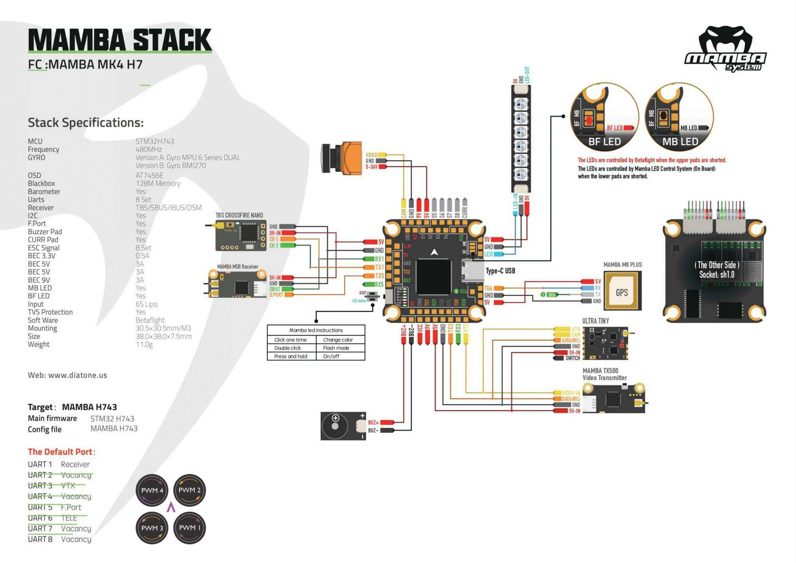

# 5-Inch FPV Drone

## Overview
Design, assembly and configuration of a 5-inch freestyle FPV drone based on Betaflight.

## Objectives
- Build a reliable and maintainable FPV drone
- Optimize flight stability
- Configure the flight controller, ESC, radio receiver and VTX
- Understand PID tuning and filtering

## Hardware Used
| Component | Reference |
|----------|-----------|
| Frame | MotorRiot Tanq2 |
| Flight Controller | Mamba MK4 H743 V2 |
| ESC | Diatone 4in1 F55 128K |
| Motors | Velox V2207 V2 1750KV |
| FPV Camera | Foxeer T-Rex mini |
| Video Transmitter | SpeedyBee TX800 |
| Radio Receiver | RadioMaster Nano ELRS RP1 2.4 GHz V2 |
| Battery | LiPo Tattu 6S 1300 mAh |
| Buzzer | Vifly Finder 2 Autonomous Buzzer |

## System Architecture
The drone is built around an H7 flight controller connected to a 4-in-1 ESC, four brushless motors, an ExpressLRS receiver, an FPV camera and an analog video transmitter.

The wiring diagram below summarizes the main electrical and signal connections.

Main connections:
- The LiPo battery powers the 4-in-1 ESC directly.
- The ESC powers and communicates with the flight controller.
- The motors are driven through the ESC using the DShot protocol.
- The ExpressLRS receiver communicates with the flight controller through CRSF over UART.
- The FPV camera is connected to the flight controller for OSD overlay.
- The VTX receives video output from the flight controller and is configured through IRC Tramp over UART.

## Software Configuration
- Firmware: Betaflight
- UART configuration
- Video System : Analogic via IRC Tramp transmitter protocol
- ESC protocol: DShot 600
- Radio protocol: CRSF

## Tuning
- Flight modes: ACRO
- Failsafe stage 1 and 2 configured
- PID tuning
- Gyro filters
- Rates
- OSD
- Blackbox

## Tests Performed
- Electrical continuity test
- Motor direction check
- Failsafe test
- First hover test
- Stability tests
- Filter/PID adjustments

## Issues Encountered
- Video noise
- Solutions implemented

## Results
- Final weight:
- Flight time:
- Flight behavior:
- Future improvements:

## Media
Add photos, wiring diagrams or videos here.
